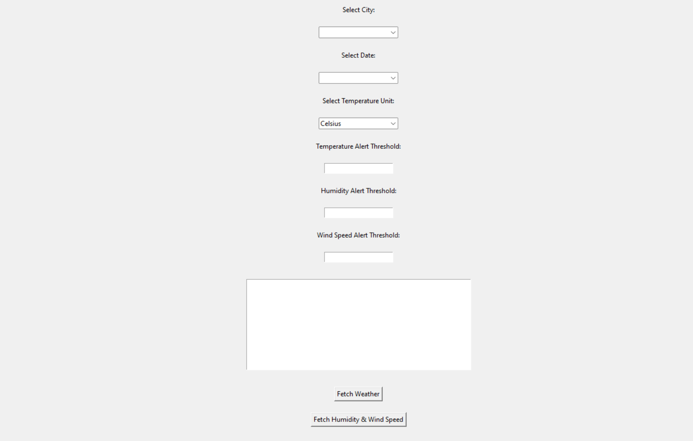

# Real-Time Data Processing System for Weather Monitoring

## Overview
This project is a real-time data processing system to monitor weather conditions and provide summarized insights using rollups and aggregates for major cities in India using the OpenWeatherMap API (https://openweathermap.org/).

## Features
- **Real-time weather data retrieval**
- **Temperature conversion from Celsius to Kelvin (according to user preference)**
- **Daily weather summaries with average, maximum, and minimum temperatures**
- **Dominant weather condition determination**
- **Data retrieval upto 5 days based on a 3 hourly forecast**
- **Console Alerting system for user-defined thresholds**
- **Visualization of daily summaries and aggregates**
- **Support for additional weather parameters (humidity, wind speed) in daily summaries (Bonus)**

## Project Structure

- `app.py`: Contains the main application code.
- `.env`: Environment file to store the OpenWeatherMap API key.
- `requirements.txt`: Lists the required dependencies.
- `README.md`: This documentation file.
- `weather_data.db`: Stores the daily summaries in a database everythime the application is run.

## Instructions
### Prerequisites
    - Python 3.8 or higher
    - An OpenWeatherMap API key

### Build and Install
### Create a virtual environment 
     python -m venv venv
### Initialize the virtual environment 
     venv/Scripts/activate
### Install the required packages:
     pip install -r requirements.txt
### Create a `.env` file in the root directory with your OpenWeatherMap API key:
     API_KEY=<your_actual_api_key_here>

Configure the system by updating `app.py` with other settings if needed.

### Running the Application
     python app.py

This will generate a Graphical User Interface for the user to work upon the cities, dates and temperature unit selection. The GUI also provides a real time log where the user can see major weather details. The user can fetch the temperature graph from the `Fetch Weather` button and the humidity and wind speed graph from the `Fetch Humidity and Wind` button. The application also logs the details in the platform console and adds the data to the `weather_data.db`. The user can also find the temperature aggregates through the graph, database and even in the gui console.

## Snippets

### Basic UI

